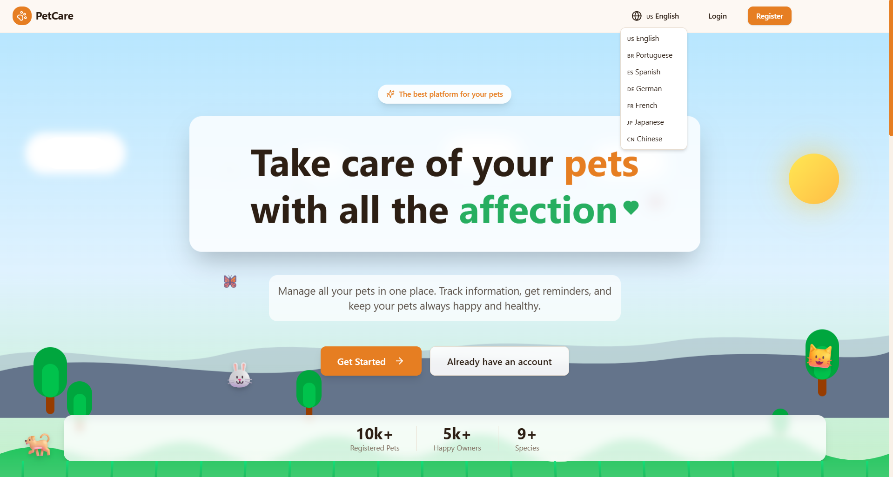
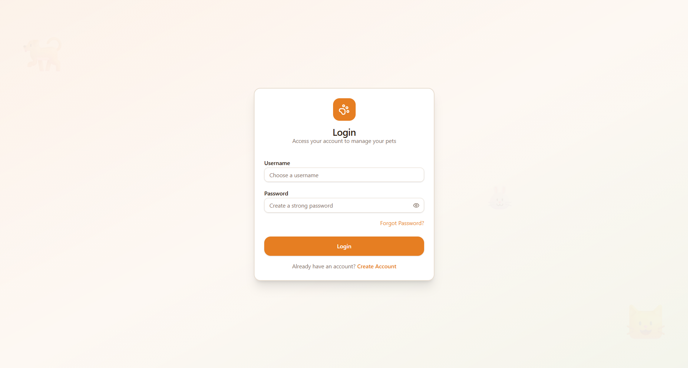
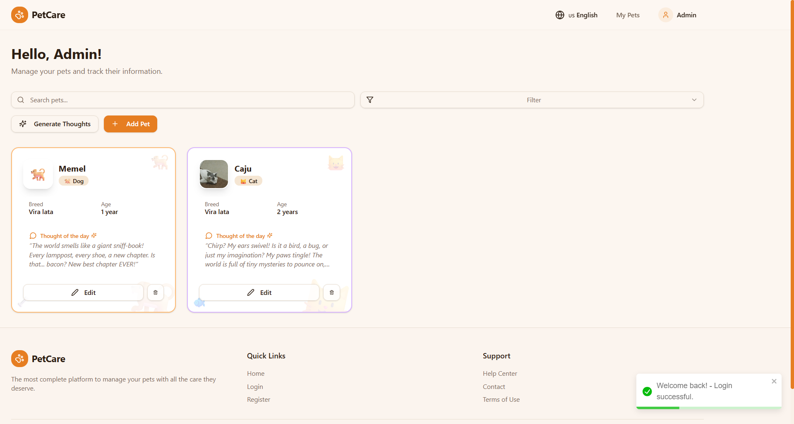

# PetCare --- Full-Stack Application

- **Backend:** Django REST API with JWT authentication, Celery, LLM (Gemini) integration to generate animal thoughts, and Docker for deployment.
- **Frontend:** Modern interface built with React + Vite + Tailwind, smooth animations, and full internationalization.

The goal is to allow pet owners to register their animals, track data, and receive daily AI-generated thoughts.

---

# 🧱 Technologies

## 🔹 Backend (Django)

- Python (Django)
- Django REST Framework
- JWT Authentication
- Celery
- Redis
- Gemini API Key
- PostgreSQL
- Docker
- Docker Compose
- Service Worker
- drf-spectacular (OpenAPI docs)

## 🔹 Frontend (React)

- React + Vite
- TypeScript
- Zustand
- React Query
- Tailwind CSS
- React Router DOM
- framer-motion
- react-scroll-parallax
- i18n (8 languages)

---

# 🔧 Services Used

- **Github**
- **Render**
- **Vercel**
- **Supabase**

---

# 🚀 Getting Started (Backend)

### Dependencies

- Docker
- Docker Compose

### Build containers:

    sudo docker-compose build

### Create database and run migrations:

    sudo docker-compose run --rm app bundle exec rake db:seed

### Install dependencies:

    sudo docker-compose run --rm app bundle install

### Run the project:

    sudo docker-compose up

---

- Initial Page

- Login Page

- Dashboard Page

# 🔗 Links

- **Vercel:** https://animals-teal.vercel.app
- **Original Repository:** https://github.com/GiseleBCSantos/animals

---

# 🧭 Versioning

**1.0.0.0**

---

# ✍️ Author

**Gisele Santos**

Follow on GitHub and contribute!
Thanks for visiting and happy coding!
